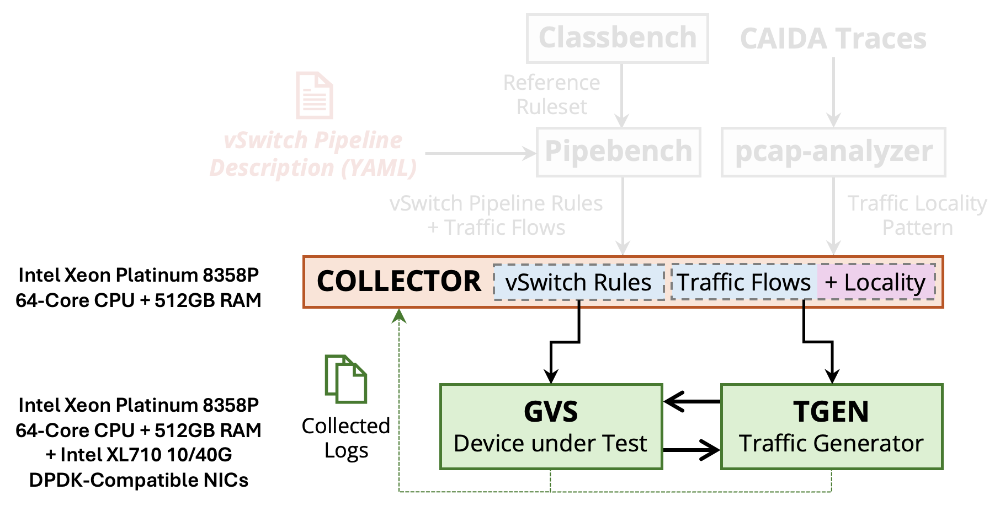

# Installation

!!! Dependencies

    All dependencies and their installation is managed via **Ansible** which we run through a `docker` container. The only required dependency for this setup is `docker`. Follow the steps specified at this [link](https://docs.docker.com/engine/install/ubuntu/#install-using-the-repository) and then allow non-root users to use docker by following these [steps](https://docs.docker.com/engine/install/linux-postinstall/).

## Testbed Setup

The testbed setup requires 3 machines: 

<!--  -->
<figure markdown="span" id="testbed-figure">
  { width="700" }
  <figcaption>Figure 2: The Expected Testbed Setup for Running Gigaflow Artifact</figcaption>
</figure>

* Collector (to store rulesets/traces and collect logs)
* GvS Device-under-Test (to run `gvs`)
* Tgen (to send/receive traffic)

The physical resources required on each machine are labeled on [Figure 2](#testbed-figure).

!!! Tip

    These three machines can also be VMs running on the same physical host. The experiments in the paper were performed where the **Ansible** orchestrator was running on the same machine as `gvs` but it could also run on the `tgen` or the collector machine. Finally, the collector can also be the same VM/machine running `gvs` or `tgen`. 

## Testbed Configuration

We use Ansible to orcherstrate all experiments using these three machines. Therefore, we require `root` access to each of them. To populate for each machine, update the `inventory.ini` file as following:

```yaml title="inventory.ini" linenums="1"
[NODES]
TGEN ansible_host=<tgen-ip> ansible_user=<tgen-username> ansible_password=<tgen-password> ansible_sudo_pass=<tgen-root-password>
GVS ansible_host=<ovs-ip> ansible_user=<ovs-username> ansible_password=<ovs-password> ansible_sudo_pass=<ovs-root-password>

[STORAGE]
COLLECTOR ansible_host=<collector-ip> ansible_user=<collector-username> ansible_password=<collector-password> ansible_sudo_pass=<collector-root-password> ansible_ssh_user=<collector-username> ansible_ssh_pass=<collector-root-password>
```
