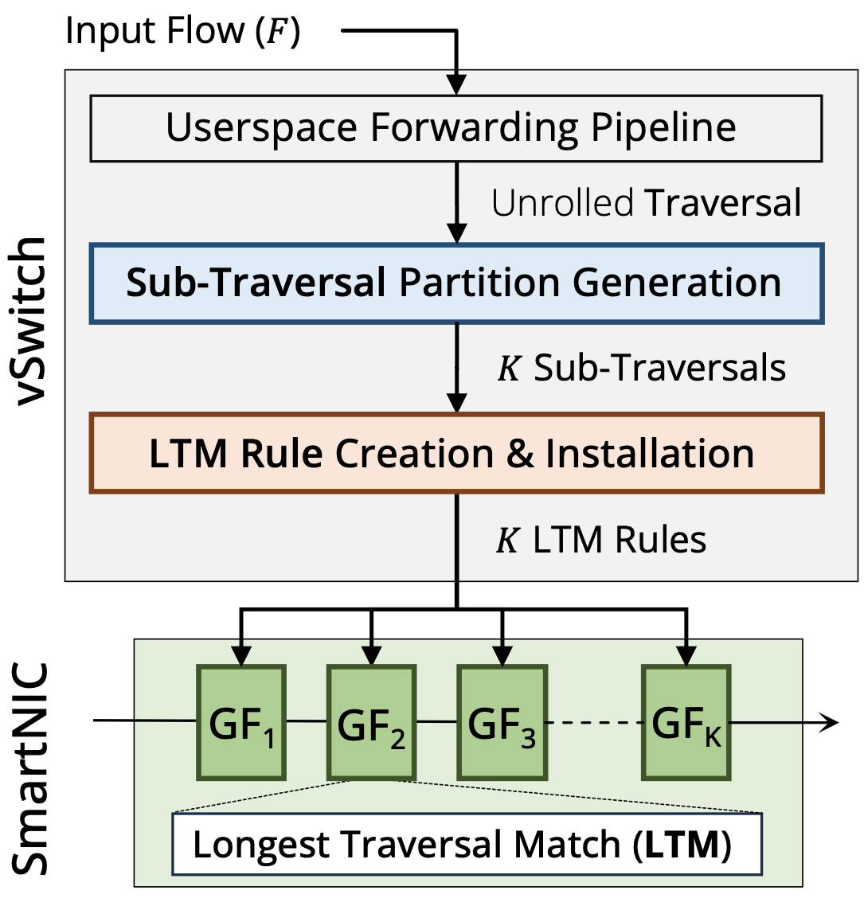

# Gigaflow Virtual Switch (GvS)

## The Gigaflow Project

Gigaflow is a multi-table cache architecture for the Open vSwitch that captures pipeline-aware locality from the vSwitch pipelines in addition to the temporal and spatial locality captured by traditional caches (e.g., Microflow and Megaflow in OvS). 
This allows Gigaflow to deliver significantly higher hit rate and lower per-packet end-to-end latency.
Unlike traditional caches that capture entire traversals as cache entries, Gigaflow determines the most suitable sub-traversals that could be shared among many flows, thereby capturing a cross-product rule space in the cache.

<!--  -->
<figure markdown="span">
  { width="500" }
  <figcaption>Figure 1: Gigaflow Cache in Open vSwitch</figcaption>
</figure>

## The Documentation
This documentation will take you through the Gigaflow implementation as a new caching sub-system in the Open vSwitch (OVS).
It elaborates how to setup and install Gigaflow with Open vSwitch, generate vSwitch pipelines and traffic flows, how to run the automated experiment scripts (based on Ansible), and how to view the results.