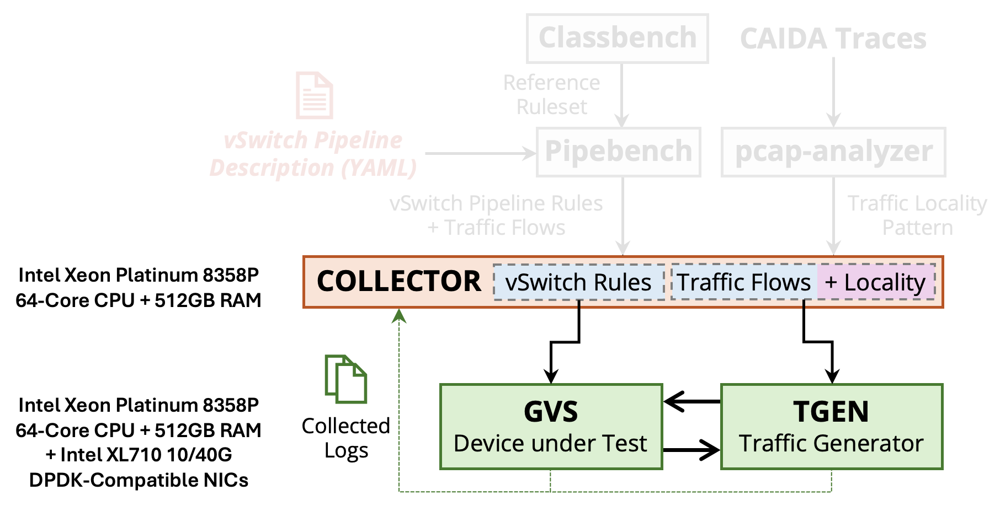

# Installation Guide

## Prerequisites

<!-- !!! Dependencies -->

All dependencies and their installation is managed via **Ansible** which we run through a `docker` container. 
So, the only required dependency for this setup is `docker`. 
Follow the steps specified at this [link](https://docs.docker.com/engine/install/ubuntu/#install-using-the-repository) and then allow non-root users to use docker by following these [steps](https://docs.docker.com/engine/install/linux-postinstall/).

## Testbed Setup

<figure markdown="span" id="testbed-figure">
  { width="900" }
  <figcaption>The testbed setup to run Gigaflow out-of-the-box</figcaption>
</figure>

The testbed requires 3 machines: 

* `COLLECTOR` &#8594; to store rulesets/traces and collect logs
* `GVS` &#8594; device-under-test to run `gvs`
* `TGEN` &#8594; to send/receive traffic

### Hardware Requirements

The physical resources required on each machine are labeled on above [figure](#testbed-figure).

!!! Tip

    These three machines can also be VMs running on the same physical host. The experiments in the paper were performed where the **Ansible** orchestrator was running on the same machine as `gvs` but it could also run on the `tgen` or the collector machine. The collector can be the same VM/machine running `gvs` or `tgen`. Finally, the memory and CPU requirements might seem bloated because of the test setup used for experiments. You should be able to run with much fewer resources (e.g. 16 cores, 16GB RAM) as long as the Intel XL710 10/40G NICs are available.

## Workloads
To evaluate a virtual switch, you need some packet pipeline rulesets and matching traffic traces.
We have provided a set of 5 real-world vSwitch pipelines, their corresponding rulesets and traffic traces that we used for benchmarking Gigaflow.
The following are their detailed descriptions (more details in the [paper](https://dl.acm.org/doi/10.1145/3676641.3716000)).

| **Pipeline** | **Description** | **Tables** | **Traversals** |
|:--------:|-----------|:------:|:----------:|
| OFD | CORD’s Openflow data plane abstraction (OFDPA) for HW/SW switch integration | 10 | 5 |
| PSC | An example L2L3-ACL pipeline implemented for the Pisces paper | 7 | 2 |
| OLS | OVN Logical Switch pipeline to manage logical virtual network topologies in OVS | 30 | 23 |
| ANT | Antrea pipeline implementing networking and security for Kubernetes clusters | 22 | 20 |
| OTL | Openflow Table Type Patterns (TTP) to configure L2L3-ACL policies using OVS | 8 | 11 |

### Download 

Example pipelines, their rulesets, and traffic traces used for benchmarking Gigaflow are publicly available via [FigShare](https://figshare.com/articles/dataset/Gigaflow_vSwitch_Pipelines_and_Traffic_Traces/28489208).
Download and place them on the `COLLECTOR` machine as following:

Step 1: create directory

```shell title="shell"
mkdir ~/Gigaflow
cd ~/Gigaflow
```

Step 2: download the traffic traces and pipelines
```shell title="shell"
wget --content-disposition "https://figshare.com/ndownloader/files/52608875"
# .. and vSwitch pipelines
wget --content-disposition "https://figshare.com/ndownloader/files/52608872"
```

Step 3: unzip the downloaded files
```shell title="shell"
unzip Traffic-Locality.zip
unzip vSwitch-Pipelines.zip
```

Step 4: rename downloaded directories to match the vars/main.yml file
```shell title="shell"
mv Traffic-Locality mini_profiles
mv vSwitch-Pipelines ovs-pipelines
```

Now, we are ready to setup the orchestrator and install `gvs` and the traffic generator (`tgen`).

## Orchestrator Setup

You only need to setup the [gigaflow-orchestrator](https://github.com/gigaflow-vswitch/Gigaflow-Artifact-ASPLOS2025/) repository that will bringup the testbed, install all dependencies (including `gvs` and traffic generator), and run the experiments. 
The orchestration is enabled via **Ansible** which itself is provided as a docker container.

!!! Note
    All the steps from this point onwards must be run on your orchestrator machine. For our experiments, we used the `gvs` machine as our orchestrator but you can choose a different machine too as long as it has `docker` installed.

Clone the orchestrator repository as following:

```shell title="shell"
git clone https://github.com/gigaflow-vswitch/Gigaflow-Artifact-ASPLOS2025/
```

### Update Local Paths

In this repository, modify the following variables in the [vars/main.yml](https://github.com/gigaflow-vswitch/Gigaflow-Artifact-ASPLOS2025/blob/asplos-25/vars/main.yml) file:

```yaml title="vars/main.yml" linenums="171"
retrieve:
  caida:
    path: "/home/<username>/Gigaflow/mini_profiles"
  pipelines:
    path: "/home/<username>/Gigaflow/ovs-pipelines"
  destination: 
    path: "/tmp/{{ project.name }}/pipelines-and-traffic"
```

Update only the `retrieve.caida.path` and `retrieve.pipelines.path` variables to point to a Gigaflow directory on the `COLLECTOR` machine.

### Inventory Configurations

We use Ansible to orcherstrate all experiments using the three machines. 
Therefore, we require `root` access to each of them. 
To populate for each machine, update the [inventory.ini](https://github.com/gigaflow-vswitch/Gigaflow-Artifact-ASPLOS2025/blob/asplos-25/inventory.ini) file as following:

```yaml title="inventory.ini" linenums="1"
[NODES]
TGEN ansible_host=<tgen-ip> ansible_user=<tgen-username> ansible_password=<tgen-password> ansible_sudo_pass=<tgen-root-password>
GVS ansible_host=<ovs-ip> ansible_user=<ovs-username> ansible_password=<ovs-password> ansible_sudo_pass=<ovs-root-password>

[STORAGE]
COLLECTOR ansible_host=<collector-ip> ansible_user=<collector-username> ansible_password=<collector-password> ansible_sudo_pass=<collector-root-password> ansible_ssh_user=<collector-username> ansible_ssh_pass=<collector-root-password>
```

To test if all machines are reachable, run the following command:

```shell title="shell"
cd Gigaflow-Artifact-ASPLOS2025
make ansible
```

This should start an `Ansible` docker container.
Run the next commands from inside this container.

!!! Note

    Except for `make ansible`, all make targets must always be run from inside this Ansible docker container.

```shell title="Ansible Container"
make ping
```

This should be successful and return something like this:

```shell
root@nga2-vm2:/workdir# make ping
ansible all -m ping
COLLECTOR | SUCCESS => {
    "ansible_facts": {
        "discovered_interpreter_python": "/usr/bin/python3"
    },
    "changed": false,
    "ping": "pong"
}
GVS | SUCCESS => {
    "ansible_facts": {
        "discovered_interpreter_python": "/usr/bin/python3"
    },
    "changed": false,
    "ping": "pong"
}
TGEN | SUCCESS => {
    "ansible_facts": {
        "discovered_interpreter_python": "/usr/bin/python3"
    },
    "changed": false,
    "ping": "pong"
}
```

This means all machines are reachable and you can now proceed to the next step.

### GvS and TGen Installation

Now, you can install [gvs](https://github.com/gigaflow-vswitch/gvs) and [tgen](https://github.com/gigaflow-vswitch/tgen) along with all their dependencies as following:

```shell title="Ansible Container"
make setup-gvs-experiment
```

You can also install them separately as following:

```shell title="Ansible Container"
make install-dataset
make install-gvs
make install-tgen
```

At this point, you have succesfully installed `gvs` on the `GVS` machine and `tgen` on the `TGEN` machine.
You have also retrieved and placed your pipelines and traffic traces on both machines and now you are ready to start running experiments!

## Directory Structure

```
gigaflow-orchestrator/
├── roles/          # Ansible roles for all components needed to run GvS experiments
│   ├── collector/
│   ├── dpdk/
│   ├── gvs/
│   ├── logging/
│   ├── retrieve/
│   ├── rules/
│   └── tgen/
├── scripts/        
├── vars/           # Experiment variables
├── inventory.ini   # Ansible inventory file
├── ansible.cfg     # Ansible configuration file
├── Makefile        # Makefile for the ansible playbook targets
├── gvs.yml         # top-level gvs yaml playbook
├── tgen.yml        # top-level tgen yaml playbook
└── ...             # other top-level yaml playbooks
```

## Next Steps

For detailed instructions on using Gigaflow in your testbed, please refer to our [usage guide](usage.md).

To evaluate Gigaflow performance against Megaflow cache with real-world workloads, please refer to our [benchmarking guide](benchmarks.md).

## Additional Documentation

* [Getting Started](getting-started.md)
* [Technical Details](technical-details.md)
* [Performance Benchmarks](benchmarks.md)
* [Usage Instructions](usage.md)