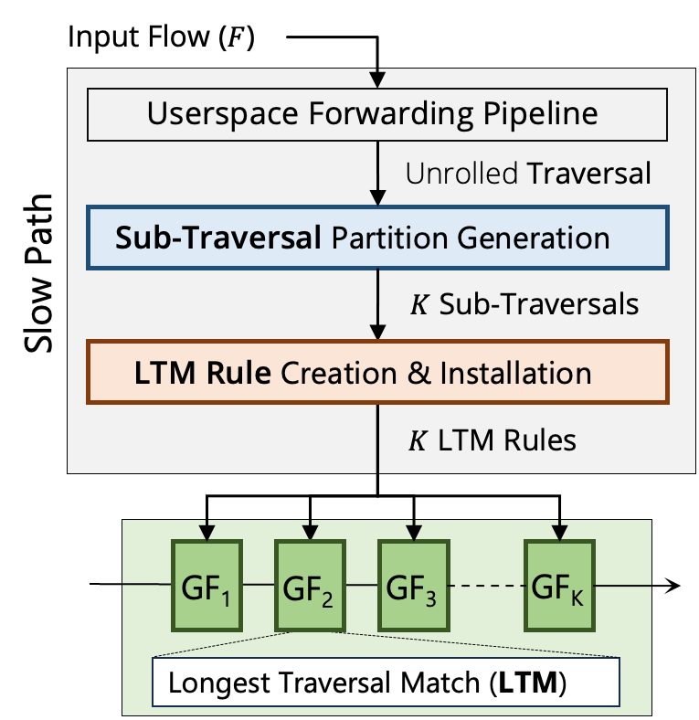

# Technical Deepdive

This document describes the technical architecture and implementation details of Gigaflow.

## Gigaflow Architecture

Gigaflow is built as a caching sub-system in the Open vSwitch.

<!-- <figure markdown="span">
  { width="500" }
  <figcaption>Figure 1: Gigaflow cache in the Open vSwitch (OVS)</figcaption>
</figure> -->

<figure id="gigaflow-figure">
  
  
  <figcaption>Gigaflow cache in the Open vSwitch (OVS)</figcaption>
</figure>

* The input packet that misses the cache is sent to the userspace where its `flow` is extracted (header field set).
* The flow passes through the vSwitch pipeline and its traversal is collected.
* Then, the travesal mapper, based on disjointedness, captures pipeline-aware locality from this traversal and suggests suitable sub-traversals to be cached.
* Finally, Longest Traversal Matching (LTM) cache entries are generated and installed into the Gigaflow table.

## Pipeline-Aware Locality

The following figure shows an example of how pipeline-aware locality captures unseen traversals by caching shared sub-traversals.
We _smartly_ partition the traversal and determine suitable sub-traversals that have a high likelihood of being reused in the future by other flows.

<figure id="gigaflow-figure">
  
  <figcaption>An example of Gigaflow cache in action with three packets</figcaption>
</figure>

### Disjointedness Property

Capturing pipeline-Aware locality is expensive ([see the paper](https://dl.acm.org/doi/10.1145/3676641.3716000)) but we observe the following: disjoint sub-traversals maximize the cross-product rule space in Gigaflow tables. 
We implement a dynamic program to find disjoint sub-traversals in a given traversal and this algorithm processes the traversal of each cache miss without looking at how previous cache entries were generated.

<figure id="disjointedness-figure">
  
  <figcaption>Gigaflow captures pipeline-aware locality by capitalizing on field-level disjointedness in traversals</figcaption>
</figure>

## Mapping Traversals to Gigaflow

### Traversal Processing

The [map_traversal_to_gigaflow](https://github.com/gigaflow-vswitch/gvs/blob/asplos-25/lib/mapper.c#L1356) function is responsible for mapping traversals to Gigaflow tables.
It performs the following steps:

1. **Cleanup**: Cleans up mapping context before starting the mapping process.
2. **Find Available Tables**: Determines available Gigaflow tables with sufficient space for mapping.
3. **Disjointedness Exploration**: Implements the dynamic program to explore disjointedness across sub-traversals.
4. **Compose and Map Wildcards**: Composes and maps the wildcards as cache entries to the Gigaflow tables.

```C title="lib/dpif-netdev.c" linenums="1356"
void
map_traversal_to_gigaflow(struct gigaflow_xlate_context *gf_xlate_ctx,
                          struct gigaflow_mapping_context *gf_map_ctx,
                          struct gigaflow_perf_stats *gf_stats,
                          struct pmd_perf_stats *stats)
{

    /* no need to map if there was an error in translation 
       this happens for recursion too deep during resubmissions */
    if (gf_xlate_ctx->xlate_error != XLATE_OK) {
        gf_map_ctx->map_out = get_empty_mapper_out();
        gf_map_ctx->mapped_cnt = 0;
        return;
    }

    /* cleanup contexts before we start mapping 
       THIS MUST BE THE FIRST STEP WHEN WE START MAPPING */
    cleanup_before_mapping(gf_xlate_ctx, gf_map_ctx);

    /* 1. optimization passes to reduce the number of tables 
          to consider before calling path maximization DP
        a. decoupling points in traversal?
        b. header space locality opportunity?
        c. explore vs exploit? */

    /* generate bit wildcards and determine available tables for mapping */
    generate_bit_wildcards(gf_xlate_ctx, gf_map_ctx);
    find_available_tables_for_mapping(gf_map_ctx, gf_stats);

    /* 2. find and assign a traversal mapping to Gigaflow tables 
       by maximizing added paths, coupling and other objectives */
    uint64_t optimizer_cycles = cycles_counter_update(stats);
    struct mapper_out *opt_map_out = maximize_optimality(gf_xlate_ctx, 
                                                         gf_map_ctx);
    optimizer_cycles = cycles_counter_update(stats) - optimizer_cycles;
    gf_perf_update_counter(gf_stats, GF_STAT_OPTIMIZER_CYCLES, optimizer_cycles);
    gigaflow_mapping_ctx_assign_mapping(gf_xlate_ctx, gf_map_ctx, opt_map_out);

    /* 3. compose and map the wildcards as Gigaflow entries to the accel */
    uint64_t compose_cycles = cycles_counter_update(stats);
    compose_gigaflows(gf_xlate_ctx, gf_map_ctx);
    compose_cycles = cycles_counter_update(stats) - compose_cycles;
    gf_perf_update_counter(gf_stats, GF_STAT_COMPOSITION_CYCLES, compose_cycles);

    /* 4. accept this mapping iff masks are not exceeded in any Gigaflow table */
    accept_mapping_if_masks_within_limits(gf_map_ctx, gf_stats);

    const bool estimate_flow_space = 
        gf_map_ctx->gf_config->estimate_flow_space;
    if (estimate_flow_space) {
        /* 5. add this new mapping to our unique mappings */
        gigaflow_state_add_new_mapping(gf_xlate_ctx, gf_map_ctx, gf_stats);
    }
}
```

### Exploring Sub-Traversals

The function [maximize_optimality_dp](https://github.com/gigaflow-vswitch/gvs/blob/asplos-25/lib/mapper.c#L794) implements the disjoint partitioning algorithm as a dynamic program to find the optimal mapping of traversals to Gigaflow tables. 
It uses memoization to store intermediate results and avoid redundant calculations.

```C title="lib/mapper.c" linenums="794"
struct mapper_out* 
maximize_optimality_dp(struct mapper_memo *memo,
                       struct gigaflow_xlate_context *gf_xlate_ctx,
                       struct gigaflow_mapping_context *gf_map_ctx,
                       int t_start, int t_end, int g_start, int g_end)
{
    /* check memo before making any calls */
    struct dp_memo_entry *dp_cache;
    dp_cache = search_dp_memo(memo, t_start, t_end, g_start, g_end);
    if (dp_cache) {
        return dp_cache->map_out;
    }
    struct mapper_out *map_out = get_empty_mapper_out();
    /* base case - 1: 
       no more traversal tables to map? */
    if (t_end == -1) {
        map_out->score = 0;
        // nothing to map..
        return map_out;
    }
    /* base case - 2:
       only one Gigaflow table left?
       map remaining traversal tables to this Gigaflow table */
    if (g_end == 0) {
        /* get actual Gigaflow table ID before measuring optimality
           or updating a mapping on that table */
        int gf_table_id = gf_map_ctx->available_tables[g_end];
        int score = get_mapping_optimality(memo, gf_xlate_ctx, gf_map_ctx, 
                                           t_start+1, t_end, t_end+1, 
                                           gf_table_id);
        map_out->score = score;
        // update this path mapping in mapper_out
        mapper_out_update_mapping(map_out, t_start+1, t_end, t_end+1, 
                                  gf_table_id);
        // insert dp result into memo before returning
        insert_into_dp_memo(memo, map_out, t_start, t_end, 
                            g_start, g_end, score);
        return map_out;
    }
    // recursive calls
    struct mapper_out *dp_map_out;
    int mapped_score = 0, new_score = 0, max_score = 0;
    for (int t_i=t_start; t_i<=t_end; t_i++) {
        dp_map_out = maximize_optimality_dp(memo, gf_xlate_ctx, gf_map_ctx, 
                                            t_start, t_i, g_start, 
                                            g_end-1);
        /* get actual Gigaflow table ID before measuring optimality
           or updating a mapping on that table */
        int gf_table_id = gf_map_ctx->available_tables[g_end];
        mapped_score = get_mapping_optimality(memo, gf_xlate_ctx, gf_map_ctx, 
                                              t_i+1, t_end, t_end+1, 
                                              gf_table_id);
        new_score = dp_map_out->score + mapped_score;
        /* found a better or equally optimal solution? 
           replace the prior mapping for this table */
        if (new_score > max_score) {
            // free previous map_out and update to new best
            mapper_out_destroy(map_out);
            // update this path mapping in mapper_out iff t_i+1 <= t_end
            if (t_i + 1 <= t_end) {
                mapper_out_update_mapping(dp_map_out, t_i+1, t_end, 
                                          t_end+1, gf_table_id);
            }
            dp_map_out->score = new_score;
            map_out = dp_map_out;
            max_score = new_score;
        } else {
            // this solution we tried is not any better
            mapper_out_destroy(dp_map_out);
        }
    }
    // insert dp result into memo before returning
    insert_into_dp_memo(memo, map_out, t_start, t_end, 
                        g_start, g_end, max_score);
    return map_out;
}
```

### Evaluating a Sub-Traversal

The function that evaluates one sub-traversal to see if all tables overlap is called [get_coupling](https://github.com/gigaflow-vswitch/gvs/blob/asplos-25/lib/mapper.c#L677).

```C title="lib/mapper.c" linenums="677"
int 
get_coupling(struct gigaflow_mapping_context *gf_map_ctx,
             int t_start, int t_end)
{
    const uint32_t coupling_base_score = 
        gf_map_ctx->gf_config->coupling_base_score;
    int coupling = 0; // just one wildcard is not a coupling
    uint16_t next_wc_bits = EMPTY_WC;
    uint16_t curr_wc_bits = gf_map_ctx->bit_wildcards[t_start];
    for (int i=t_start+1; i<=t_end; i++) {
        next_wc_bits = gf_map_ctx->bit_wildcards[i];
        /* if either of current or next are empty wildcards OR 
           if not, have common bits, subsume into current and move on */
        if ((curr_wc_bits == EMPTY_WC) || (next_wc_bits == EMPTY_WC)
            || (curr_wc_bits & next_wc_bits)) {
            curr_wc_bits |= next_wc_bits;
            coupling += coupling_base_score; // better coupling
        } else {
            /* found decoupling within this range; bad combination */
            return 0;
        }
    }
    return coupling;
}
```

### Putting It All Together

For a given traversal, our disjoint partitioning algorithm tries all sub-traversal combinations and evaluates them for disjointedness using the [get_coupling](#evaluating-a-sub-traversal) function.
The sub-traversal combination with maximum sum of disjointedness is selected for mapping to the Gigaflow tables.