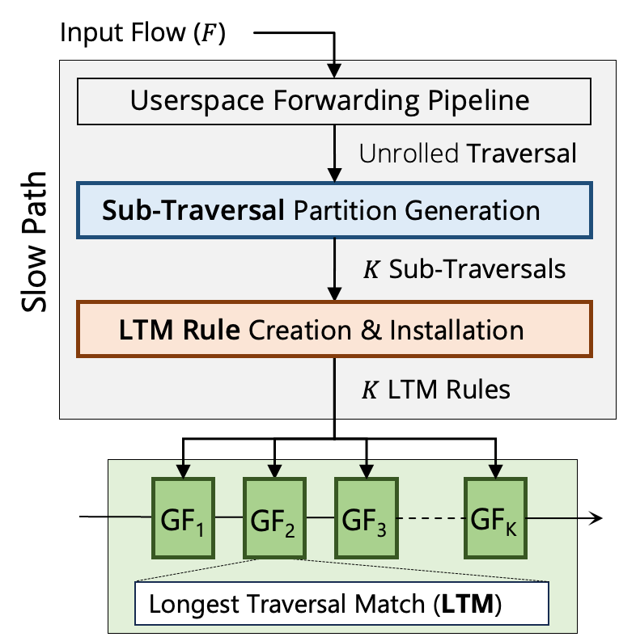

# Technical Details

This document describes the technical architecture and implementation details of Gigaflow.

## Gigaflow Architecture

Gigaflow is built as a caching sub-system in the Open vSwitch.

<!-- <figure markdown="span">
  { width="500" }
  <figcaption>Figure 1: Gigaflow cache in the Open vSwitch (OVS)</figcaption>
</figure> -->

<figure id="gigaflow-figure">
  
  
  <figcaption>Gigaflow cache in the Open vSwitch (OVS)</figcaption>
</figure>

## Pipeline-Aware Locality

<figure id="gigaflow-figure">
  
  <figcaption>An example of Gigaflow cache in action with three packets</figcaption>
</figure>

## Disjointedness Property

<figure id="disjointedness-figure">
  
  <figcaption>Gigaflow captures pipeline-aware locality by capitalizing on field-level disjointedness in traversals</figcaption>
</figure>
