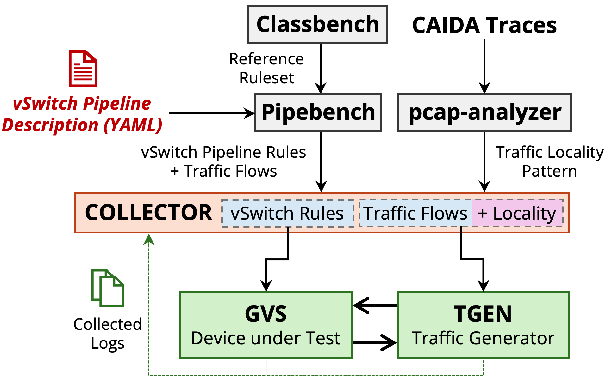

# Using Gigaflow

This guide explains how to use Gigaflow as a new caching sub-system integrated in the Open vSwitch (GvS).

## Prerequisites

The high-level Gigaflow testbed is shown in the figure below. 
It includes the following components:

<!-- <figure markdown="span" id="workflow-figure">
  { width="700" }
  <figcaption>The high-level workflow to evaluate Gigaflow (GvS)</figcaption>
</figure> -->

<figure id="workflow-figure-test">
  
  
  <figcaption>The high-level workflow to evaluate Gigaflow (GvS)</figcaption>
</figure>

!!! info
    Details about adding your own traffic traces and vSwitch pipelines are coming soon. These components include `Pipebench` and `pcap-analyzer` which are used to generate vSwitch rulesets from pipeline configurations and analyze traffic traces like CAIDA to extract traffic patterns, such as inter-arrival times and packet sizes. Together, they allow us to generate realistic workloads to evaluate Gigaflow.

We have provided pre-generated vSwitch pipelines and traffic traces for benchmarking Gigaflow on [FigShare](https://figshare.com/articles/dataset/Gigaflow_vSwitch_Pipelines_and_Traffic_Traces/28489208). 
More details about the pipelines and traces can be found in the [installation](installation.md#workloads) and [benchmarking](benchmarks.md) sections.

## Running Gigaflow and Performance Evaluation

To evaluate performance:

* Follow our [benchmarking guide](benchmarks.md) to evaluate Gigaflow against Megaflow with real-world vSwitch pipelines and traffic traces
* Use [provided workloads](installation.md#workloads) and scripts to emulate high/low locality environments

## Next Steps

* See [Installation Instructions](installation.md) for setup details
* Review [Technical Details](technical-deepdive.md) for architecture information
* Check [Benchmarks](benchmarks.md) for performance evaluation guide