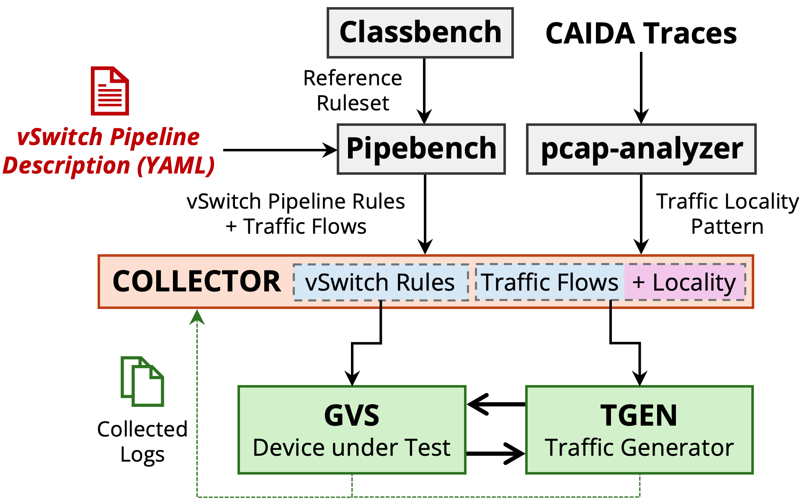

# Overview

The Gigaflow artifact is available publicly on [Github](https://github.com/gigaflow-vswitch).
All vSwitch pipelines along with the traffic traces used for evaluation are also available via [FigShare](https://github.com/gigaflow-vswitch).

<!--  -->
<figure markdown="span">
  { width="700" }
  <figcaption>Figure 1: The End-to-End Gigaflow Artifact</figcaption>
</figure>

With our artifact, we share the ansible playbooks and the source code for the various components of the Gigaflow OvS framework as described in the [ASPLOS 25 paper](https://annuszulfiqar2021.github.io/papers/gigaflow-asplos2025.pdf).

- OVS Gigaflow - https://github.com/gigaflow-vswitch/gvs.git
- Traffic Generator - https://github.com/gigaflow-vswitch/tgen.git

## Generating the vSwitch Pipelines

## Generating the Traffic Workloads
